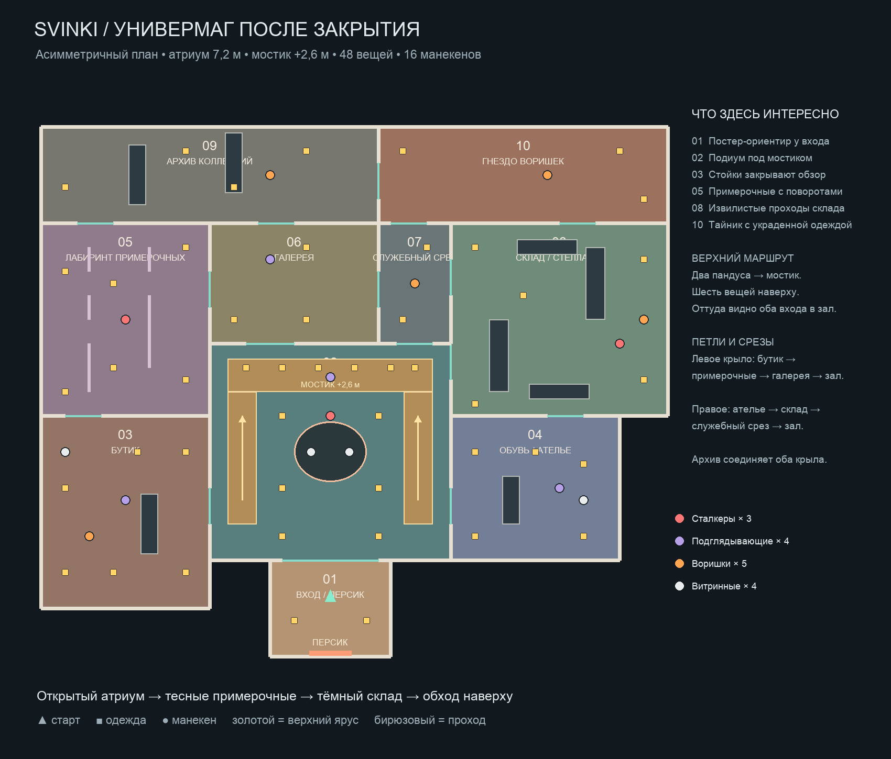

# Универмаг после закрытия

Готовый уровень находится в `Assets/Scenes/SampleScene.unity`. Запуск: открыть `Lobby`, нажать Play и выбрать одиночную игру или существующий сетевой режим.



Уровень состоит из десяти разных зон. Из входа игрок попадает в высокий атриум с круглым подиумом. Два пандуса поднимаются на мостик на высоте 2,6 м; сверху можно наблюдать за манекенами и забрать шесть предметов одежды. Под мостиком остаётся проход на первом этаже.

Левый маршрут проходит через бутик и лабиринт примерочных в галерею, затем возвращается в атриум. Правый проходит через ателье, склад со смещёнными стеллажами и служебный срез. Архив за галереей соединяет оба крыла с гнездом воришек. Мебель и высокие перегородки перекрывают обзор и создают укрытия.

В сцене 48 настоящих предметов ClothingPickup: шапки, футболки, джинсы, обувь и худи. Предметы используют существующую систему подбора и сетевые компоненты. Манекены: 3 сталкера, 4 подглядывающих, 5 воришек и 4 витринные фигуры. Исходные экземпляры и существующие игровые системы сохранены. У входа на стене висит оригинальная картинка персика из чата: `Assets/Art/LevelDesign/PeachPoster.png`.

## Исходники и восстановление

- `PeachStoreLayout.json`: координаты комнат, дверей, одежды, манекенов и основных стеллажей в метрах.
- `Tools/LevelDesign/draw_plan.py`: рисует план из той же схемы, которую читает сборщик.
- `Tools/LevelDesign/BuildPeachDepartmentStore.cs`: повторяемый сборщик сцены через живой Unity Editor. До первой сборки сохраняет снимок исходной сцены в `BeforePeachStore.unity` вне папки Assets.

Пересборка в режиме редактирования, когда открыта SampleScene:

```sh
unity command run_script --caller plugin --skill unity-cli --file Tools/LevelDesign/BuildPeachDepartmentStore.cs --entry BuildPeachDepartmentStore.Build --timeout_ms 60000
```

Сборщик обновляет только геометрию и управляемую расстановку этого уровня, сохраняет сцену, назначает уникальные FishNet scene IDs и пересобирает NavMesh по коллайдерам. NavMeshAutoBake также выполняет сборку при запуске игры. Пандусы используют гладкие наклонные коллайдеры; модель одежды и предметы подбора исключены из навигации. Стеллажи и перегородки остаются препятствиями.

## Проверка готового уровня

`Validation.json` фиксирует 48/48 достижимых мест с одеждой, 60 уникальных ненулевых сетевых идентификаторов, отсутствие пропавших компонентов и корректные стартовые позиции всех восьми движущихся манекенов. В одиночной игре проверены запуск из Lobby, нахождение всех восьми агентов на NavMesh и выдача подобранной шапки в PlayerOutfit со скрытием предмета на уровне. Ошибок в консоли при этой проверке не было.

Снимки: `StoreAtrium.png`, `StoreUpperRoute.png`, `StorePeachPoster.png`.
